# iSense-BackEnd
----
This project aims to design and develop an interactive system that integrates living conditions monitoring and human health care. The system provides general data reports and advice in real-time further. 

---
## Android Application
Please find the installer here
Make sure your installing environment is android.

---
## Application Display Video
Please find the display video [here](./display_video/isense_new.mp4)

---
## Application Display

- **Main page**
    - Loading page 
    
   
    - Emotion choosing page
    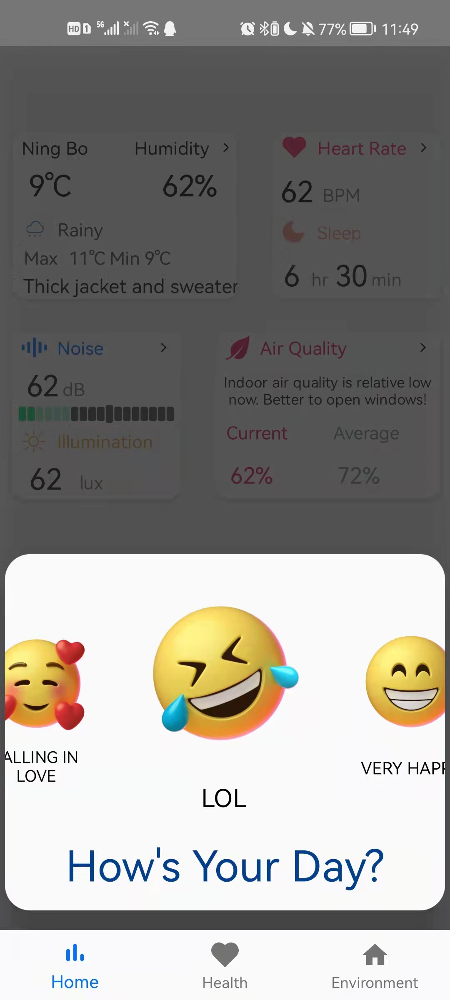

    - Main page
    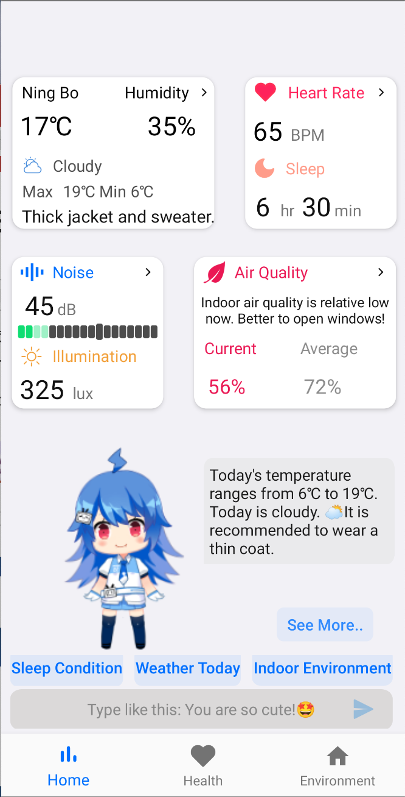

- **Health page**
  - Health main page
  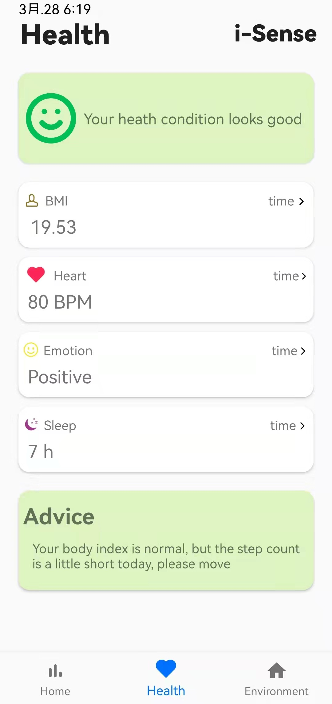

  - BMI page
  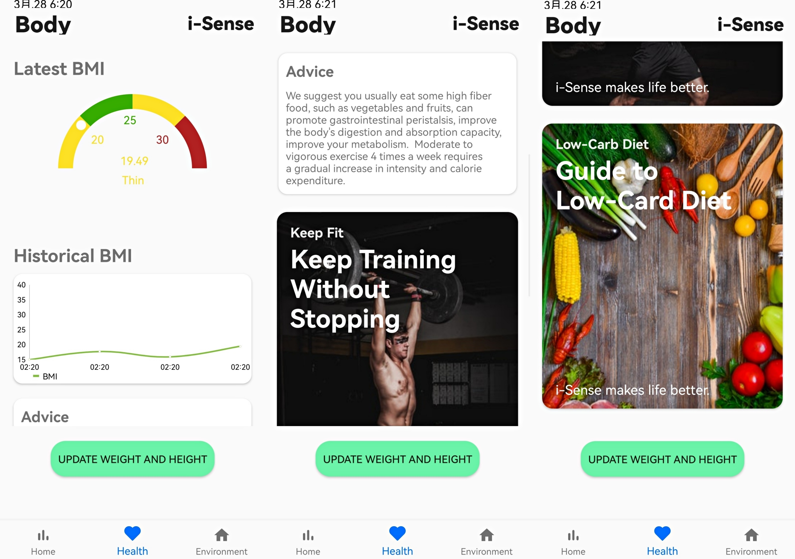

  - Heart rate & Blood oxygen page
  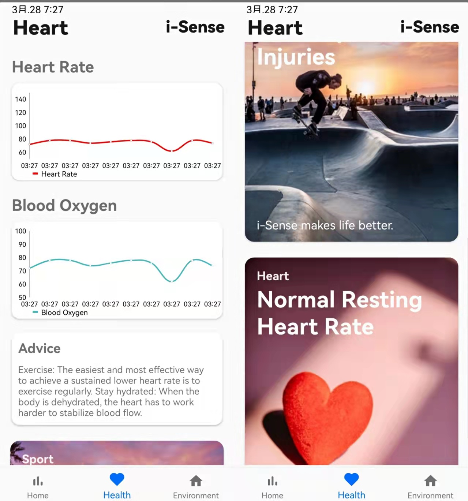

  - Sleep quality
  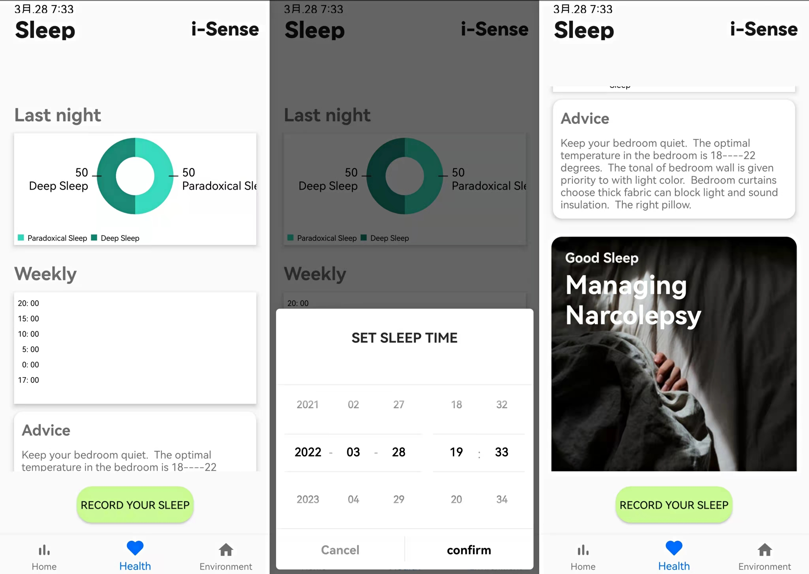 

  - Emotion Page 
  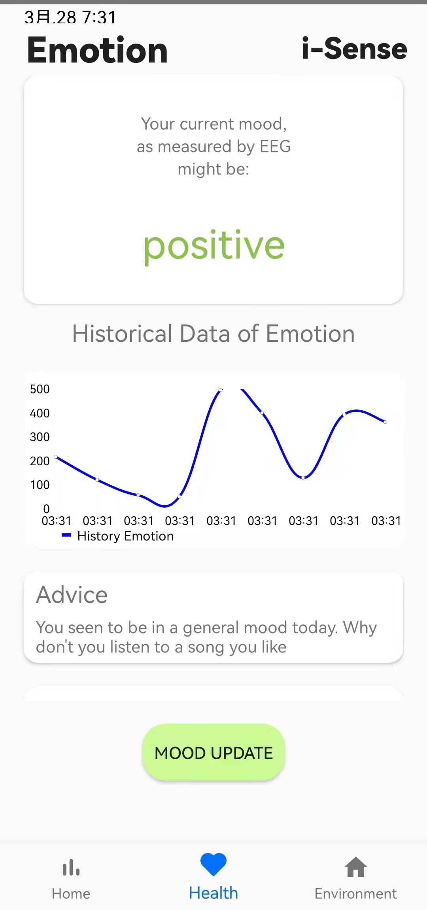

- **Environment page**
  - Environment Main page
  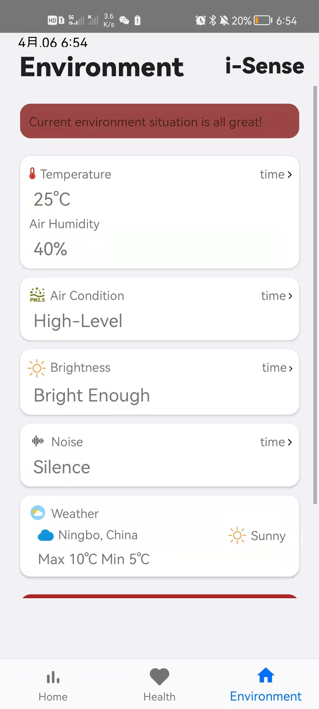

  - Temperature & humidity page 
  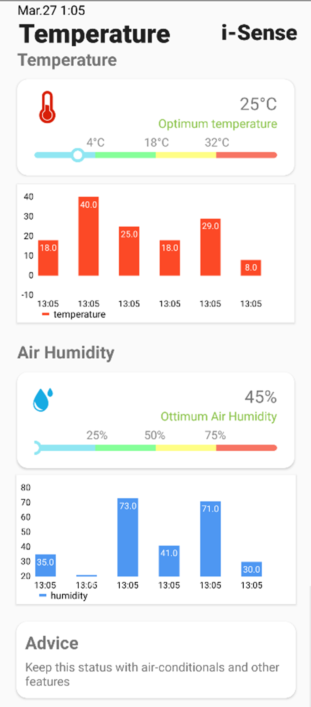

  - Air pollution page 
  

  - Brightness page 
  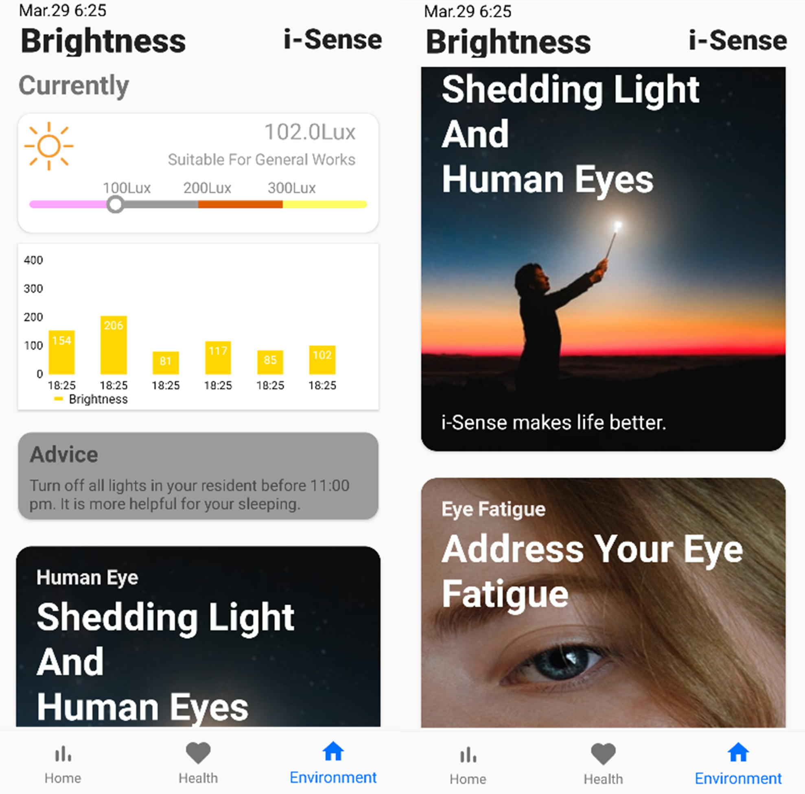
  
  - Noise page 
  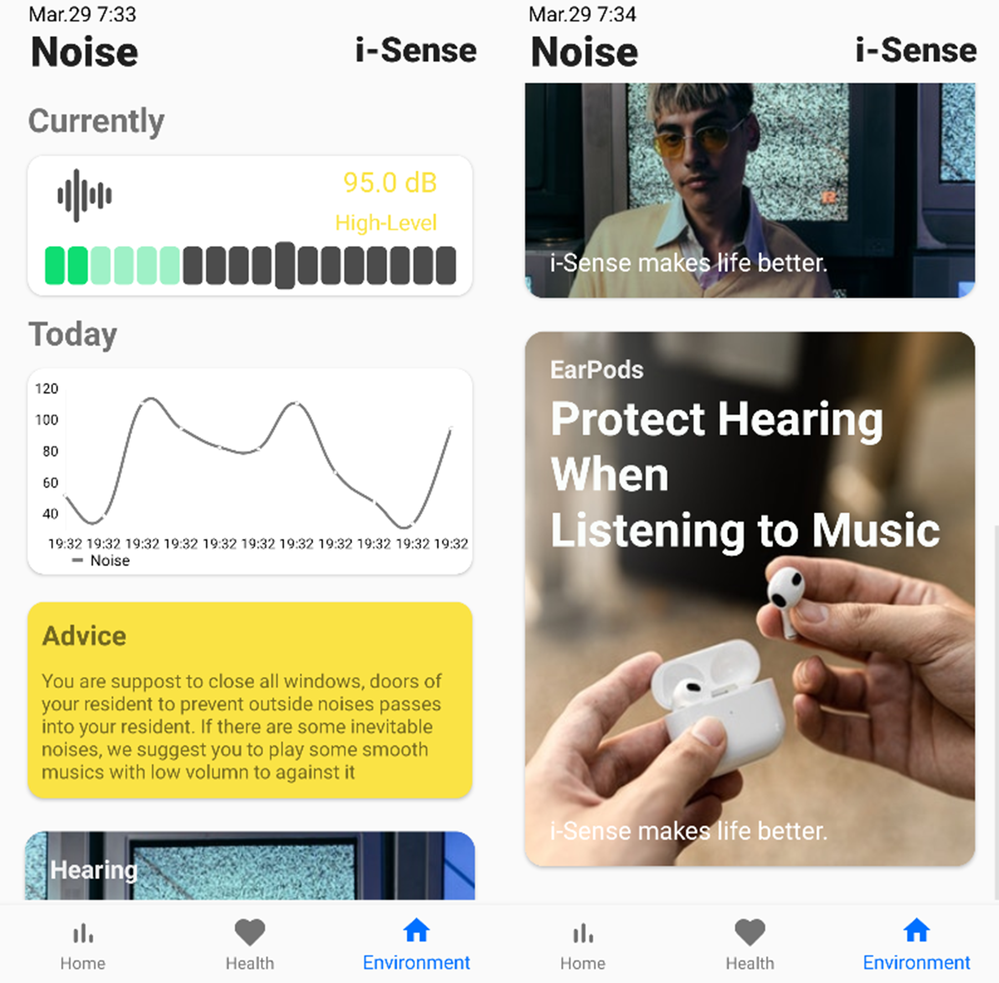
  

#### Developer version

To install and run **Isense** server on your computer:

-----

#### Running Environment: 

OS: Windows 10

JDK 17

Python 3.6 (for eeg and arduino)

Mind+(For Heart rate sensor (***DFRobot***) and Air pollution sensor(***MQ135***)) 

Arduino (For Temperature & humidity, illumination, decibel, pressure sensor,   )

Training Data-set: [SEED Dataset (sjtu.edu.cn)](https://bcmi.sjtu.edu.cn/home/seed/)

#### Database Setup

-----

* Software: ***MySQL***, ***MySQL*** ***Workbench***(Database Visualization)
* Setup: 
  * Create an account of ***MySQL***
  * Import database files ..\Hardware\database_file\iSense.sql

#### Server Running

---

* Install [IntelliJ IDEA](https://www.jetbrains.com/zh-cn/idea/download/#section=windows)
* Open ***backend*** project with [IntelliJ IDEA](https://www.jetbrains.com/zh-cn/idea/download/#section=windows)
* Run calss ***BackendApplication***

#### Connect All Sensors 

----

Follow the  *..\Hardware\Hardware_connect*  to connect all sensor

#### HR & Blood Oxygen Saturation & Air Pollution Data OBTAIN

---

* Hardware

  * ***DFRobot***
  * ***MQ135***

* Obtain HR, blood oxygen saturation and air pollution index data

  * Install [Mind+](https://mindplus.cc/)
  * Select ***Board*** MEGA2560
  * Import *..\Hardware\Mind+\MEGA.sb3*
  * Modify *..\Hardware\data2mysql\python_code2.py*
    * Add database information
  * Add libraries

    * Select ***Tools*** in Arduino's dock bar
    * Select Library Manager
    * Search ***Header Filers*** then install them.

      * Arduino_HTS221.h
      * Arduino_LPS22HB.h
      * Arduino_APDS9960.h
      * PDM.h
      * math.h
  * Import *..\Hardware\NANO\NANO.ino*
  * Run the ino file in Mind+
  * Run *..\Hardware\data2mysql\python_code2.py*

#### Other Data Obtain

------

* Hardware 

  ***NANO 33 ble*** (Integrates all other sensors)

* Obtain illumination, decibel, pressure, temperature, humidity data

  * Install [Arduino](https://www.arduino.cc/)

  * Configuring the running environment

    * Add Library *DFRobot_Heartrate.h*

  * Modify *..\Hardware\data2mysql\python_code1.py*

    * Add database information

  * Import *..\Hardware\NANO* 
  
  * Run *..\Hardware\NANO* in arduino terminal
  
  * Run *..\Hardware\data2mysql\python_code1.py*
  
    

#### EEG Data Obtain

----

* Headset Support: Emotiv+

* Obtain eeg data from emotiv plus equipment and get emotion recognition  
  * Install [Anaconda](https://www.anaconda.com/) software
  * Create a new environment for running code
  * Activate environment with  `conda activate env_name`
  * Modify the  line 1357 in ***eeg.py***, the 1st value is database ip, the 2nd value is user name of MySQL, the 3rd value is the password.
  * Run  `python .\CyKIT.py 127.0.0.1 5555 6 outputraw`
  * Install all needed libraries 
    * mysql-connector-python
    * mysqlclient
    * numpy
    * sklearn
    * torch
    * pythorch
    * _pytorch_select
    * intel-openmp
    * ninja
    * scikit-learn
  * Insert the USB of Emotiv+
  * Run `python .\CyKIT.py 127.0.0.1 5555 6 outputraw`
  * Open the ***Web\CyKIT.html*** file
  * Change the port to ***5555*** and click the ***Connect*** button

